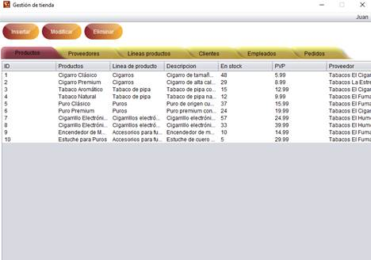

# crudapp
Java CRUD App
<table class=MsoNormalTable border=0 cellspacing=0 cellpadding=0 align=left
 width="77%" style='width:77.14%;border-collapse:collapse;margin-left:7.1pt;
 margin-right:7.1pt'>
 
  
  ÓSCAR
  GONZÁLEZ PÉREZ
  1º
  DAW
  &nbsp;
  
 

 

&nbsp;

Índice

[Iniciar sesión. 3](#_Toc136809451)

[Insertar, modificar y
eliminar elementos. 3](#_Toc136809452)

[Insertar un nuevo
producto. 4](#_Toc136809453)

[Modificar un producto
ya existente. 5](#_Toc136809454)

[Eliminar un producto. 5](#_Toc136809455)

[Insertar un nuevo
proveedor. 6](#_Toc136809456)

[Modificar un proveedor
ya existente. 6](#_Toc136809457)

[Insertar una línea de
productos. 7](#_Toc136809458)

[Modificar una línea de
productos ya existente. 7](#_Toc136809459)

[Insertar un nuevo
cliente. 7](#_Toc136809460)

[Modificar un cliente ya
existente. 8](#_Toc136809461)

[Insertar un nuevo
empleado (sin asignar usuario). 8](#_Toc136809462)

[Insertar un nuevo
empleado (asignando usuario). 9](#_Toc136809463)

[Modificar un empleado
ya existente (con usuario asignado). 9](#_Toc136809464)

[Modificar un empleado
ya existente (sin usuario asignado). 10](#_Toc136809465)

[Crear un nuevo pedido. 10](#_Toc136809466)

[Añadir y eliminar
productos del carrito de compra. 10](#_Toc136809467)

[Consultar pedidos
realizados. 11](#_Toc136809468)

[Exportar facturas de un
pedido a formato PDF. 11](#_Toc136809469)

 &nbsp;

## [Iniciar sesión](null)

Se debe introducir las credenciales
proporcionadas por un administrador.

## [Insertar, modificar y eliminar elementos](null)

En esta aplicación, teniendo el privilegio de
usuario podrás consultar las tablas de productos, proveedores, líneas de
productos, clientes y pedidos, y solo podrás realizar nuevos pedidos.

Como administrador se pueden consultar todas
las tablas existentes, aparte de poder insertar nuevos elementos a cada tabla o
modificar valores de los elementos.

Para insertar sólo deberemos dar al botón que
dice “Insertar” y nos aparecerá una nueva ventana para poder añadir un nuevo
elemento dependiendo de la tabla en la que nos encontremos.

Para modificar y eliminar es necesario
seleccionar un elemento de la tabla previamente.

A la hora de introducir datos es necesario
rellenar todos los datos obligatorios, que están señalizados con un asterisco.
Aparecerá un mensaje de error en el caso de no completar toda la información
requerida. A parte también aparecerá un mensaje de error cuando se rellenen mal
algunos campos en concreto, por ejemplo:

·&nbsp;&nbsp;&nbsp;&nbsp;&nbsp;&nbsp;&nbsp;&nbsp;
Para los números de teléfono es necesario
introducir 9 dígitos.

·&nbsp;&nbsp;&nbsp;&nbsp;&nbsp;&nbsp;&nbsp;&nbsp;
Para el DNI es necesario introducir 8 dígitos y una
letra mayúscula.

·&nbsp;&nbsp;&nbsp;&nbsp;&nbsp;&nbsp;&nbsp;&nbsp;
Para los códigos postales es necesario introducir 5
dígitos.

·&nbsp;&nbsp;&nbsp;&nbsp;&nbsp;&nbsp;&nbsp;&nbsp;
Para los correos electrónicos es necesario
introducir un correo válido, por ejemplo: “example@example.es”.

·&nbsp;&nbsp;&nbsp;&nbsp;&nbsp;&nbsp;&nbsp;&nbsp;
Para los sitios web es necesario introducir una
dirección válida, por ejemplo: “www.example.es”.

### [Insertar un nuevo producto](null)

### [Modificar un producto ya existente](null)

### [Eliminar un producto](null)

Cada vez que quieras eliminar un elemento, en
este caso un producto, siempre pedirá una confirmación.

### [Insertar un nuevo proveedor](null)

### [Modificar un proveedor ya existente](null)

### [Insertar una línea de productos](null)

### [Modificar una línea de productos ya
existente](null)

### [Insertar un nuevo cliente](null)

### [Modificar un cliente ya existente](null)

### [Insertar un nuevo empleado (sin asignar usuario)](null)

### [Insertar un nuevo empleado (asignando usuario)](null)

### [Modificar un empleado ya existente (con usuario asignado)](null)

### [Modificar un empleado ya existente (sin usuario asignado)](null)

### [Crear un nuevo pedido](null)

A la hora de realizar un nuevo pedido vemos la
siguiente ventana en la que en la parte izquierda podemos ver una lista de los
productos que se encuentran en venta con sus respectivos identificadores y a la
derecha vemos una lista que pertenece al carrito de la compra del cliente en
cuestión, el cual se puede seleccionar de los clientes ya existentes en la base
de datos abajo a la derecha.

#### [Añadir y eliminar productos del carrito de compra](null)

Para insertar un producto al carrito de compra
es necesario seleccionar un producto de la lista de productos en venta,
escribir la cantidad deseada de use producto y dar al botón de “Añadir”.

Para eliminar un producto del carrito,
deberemos seleccionar ese producto de la lista del carrito y dar al botón que
dice “Eliminar”.

Una vez ya estén todos los productos
insertados en la lista del carrito procedemos a seleccionar el cliente
destinatario y clicamos en el botón de “Insertar pedido”.

### [Consultar pedidos realizados](null)

Para consultar un pedido deberemos hacer doble
clic izquierdo sobre el pedido que se quiera consultar.

#### [Exportar facturas de un pedido a formato PDF](null)

Si damos al botón que dice “Exportar factura”
nos aparecerá una ventana emergente para poder seleccionar una ruta de destino
para nuestra factura en formato PDF.

Nos generará un PDF como el que se ve a continuación.

